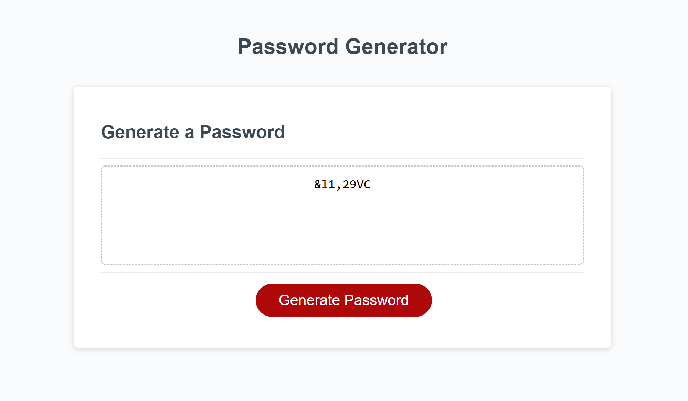

# **Password Generator**

## **This project is about building a password generator for an employee with access to sensitive data. This allow the person to randomly generate a password that meets certain criteria providing a password with strong security** 

* HTML and CSS file was provided and not modified. 
* A Javascript file was created to build a password generator.
* The user can select what criteria is to be included in the password, diverse questions are provided to accomplish this purpose. 
* In the first question the user can choose the password length, with a minimum of 8 characters and a maximum of 128 characters. 
* The four following questions are related to the type of characters, these are: upper case letters, lower case letters, numeric and/or special characters.
* The user should include at least one of the criteria of the type of characteres.
* When the user answers all the questions, the password is generated on the screen matching the selected criteria .  

💡 See live version here: [https://marcelamejiao.github.io/Password-Generator/](https://marcelamejiao.github.io/Password-Generator/)

### **Preview**

